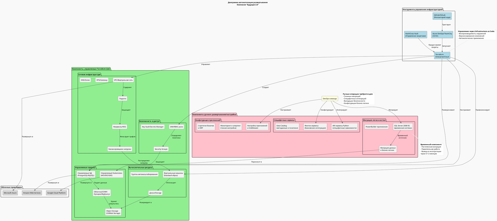

## Диаграмма автоматизации развёртывания

## Компонентная схема с указанием типа управления
### Компоненты, управляемые Terraform (Infrastructure as Code):
1. Сетевая инфраструктура
- VPC/Виртуальные сети и подсети
- Межсетевые экраны и группы безопасности
- Балансировщики нагрузки
- VPN-шлюзы и DNS-зоны
- Пиринговые соединения между VPC
2. Вычислительные ресурсы
- Виртуальные машины (базовые образы)
- Диски и хранилища
- Группы автомасштабирования
- Управляемые Kubernetes-кластеры
3. Управляемые сервисы
- Облачные БД (PostgreSQL, MySQL, Azure SQL)
- Data Warehouses (Synapse, BigQuery, Redshift)
- Object Storage (S3, Blob Storage, Cloud Storage)
- Очереди и брокеры сообщений
4. Безопасность и управление доступом
- IAM роли и политики
- Key Vault / Secrets Manager
- Мониторинг и логирование (базовая настройка)

### Компоненты для ручного развертывания/настройки:
1. Легаси-системы (временные)
- SQL Server 2008 R2 (во время миграции)
- PowerBuilder клиентские приложения
- Apache Camel шина данных
2. Конфигурация приложений
- Настройка middleware и бизнес-логики
- Конфигурационные файлы прилож

